# Laboratorio 4: Cinemática directa con Phantom X

<a name="readme-top"></a>

<!-- PROJECT LOGO -->
<br />
<div align="center">
  <a href="https://github.com/Danmunozbe/Laboratorio_4-Cinematica_directa">
    
  </a>

  <h3 align="center">Laboratorio 4: Cinemática directa</h3>

  <p align="center">Robótica
    <br />
    <a href="https://github.com/Danmunozbe/Laboratorio_4-Cinematica_directa"></a>
    <br />Daniel Muñoz · Christian Vargas
  </p>
</div>

<!-- TABLE OF CONTENTS -->
<summary>Índice</summary>
  <ol>
    <li>
      <a href="#introducción">Introducción</a>
    </li>
    <li>
      <a href="#planteamiento-de-la-solución">Planteamiento de la solución</a>
    </li>
    <li>
      <a href="#ros-integración-rospy">ROS: integración rospy</a>
      <ul>
        <li><a href="#moverobot">moveRobot</a></li>
        <li><a href="#jointcommand">jointCommand</a></li>
        <li><a href="#listener">listener</a></li>
        <li><a href="#callback">callback</a></li>
      </ul>
    </li>
    <li>
      <a href="#interfaz-gráfica-rviz-python-y-ros">Interfaz gráfica: RVIZ (Python y ROS)</a>
      <ul>
        <li><a href="#simulación-en-video-y-comprobación-de-los-ángulos">Simulación en video</a></li>
      </ul>
    </li>
    <li>
      <a href="#comparación-de-configuraciones">Comparación de Configuraciones</a>
    </li>
    <li>
      <a href="#bibliografía-y-créditos">Bibliografía y créditos</a>
    </li>
  </ol>


## Introducción

La cuarta práctica de laboratorio tiene como objetivo fundamental reforzar los conocimientos adquiridos sobre la cinemática directa y su aplicación en la manipulación real en mecanismos tales como el robot Phantom X, compuesto por 5 motores Dynamixel AX-12A como se puede observar en la siguiente figura. 

<p align="center">
    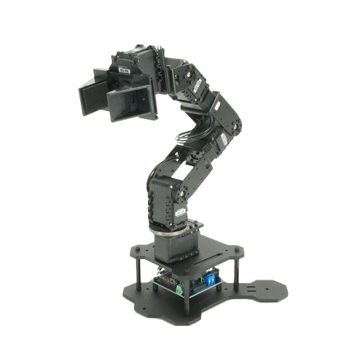
</p>


## Planteamiento de la solución

En primer lugar, se definió el diagrama del mecanismo en una posición completamente vertical, que en el caso actual será la posición Home, en concordancia con la metodología DH estándar. 

<p align="center">
    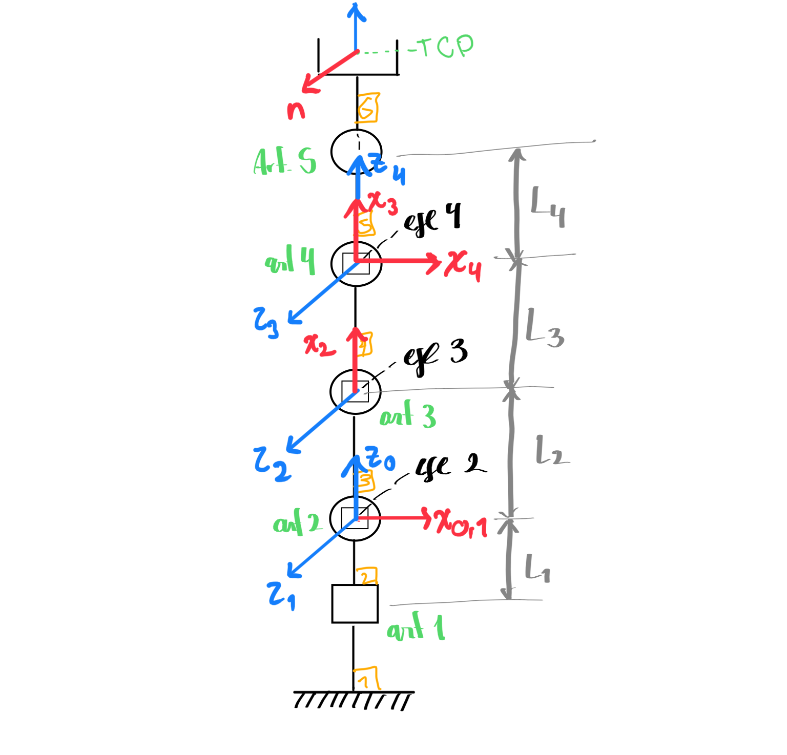
</p>

A partir de lo anterior, se muestra la tabla con los parámetros correspondientes.

<p align="center">

| i  | θ_i  | d_i  | a_i   | α_i  | offset |
|----|------|------|-------|------|--------|
| 1  | θ_1  | 5.4  | 0     | π/2  | 0      |
| 2  | θ_2  | 0    | 10.49 | 0    | π/2    |
| 3  | θ_3  | 0    | 10.78 | 0    | π/2    |
| 4  | θ_4  | 0    | 7.46  | π/2  | 0      |

</p>

## ROS: integración rospy

Se decidió realizar el código directamente en Python para la manipulación del robot. A continuación se detallan las funciones que se ejecutan para esta tarea: 

Para la solucion, se hizo uso de un servicio y una subscripión a un topic.
El servicio utilizado es `dynamixel_command` usando `Goal_position` como posición de direccion (direccion de la instruccion como nombre), donde ademas recibe el `ID` de la articulacion a mover (el cual se ha definido en un archivo .yaml), y la posición en bits (0-1023).

Para la posición incial se tomó un valor de registro de 512, basándose en la documentación del manual para los servomotores Dynamixel, en donde se indica que corresponde con 150°. De esta forma era posible tener un rango mayor de movimiento.

<p align="center">
    
</p>

En el archivo [jointRos.py](scripts/jointRos.py) se encuentran un conjunto de funciones que se utilizan para la interfaz.

### moveRobot
``` python
def moveRobot(pos,t):
    for i in range(len(pos)):
        position=int(np.round(pos[i]/0.29)+offset[i])
        jointCommand('',i+1,'Goal_Position',position,t)
        time.sleep(0.2)
    time.sleep(2)
    return
```
La funcion recibe 2 parámetros, `pos` es un arreglo de ángulos, donde en cada posición se encuentra la posicion deseada de la articulación (en grados); y `t` es un valor de tiempo ensegundos para la funcion jointCommand.
Nótese que dentro de la función se hace llamada a la función [jointCommand](README.md#jointcommand) a través de un ciclo, donde a este se le entrega el valor de la articulacion dividida en 0.29 pues cada unidad del registro equivale a 0.29 grados. Posteriormente, se le suma un valor offset que no es mas que el valor del registro en su posicion inicial (512 como se mencionó antes).  
### jointCommand
``` python
def jointCommand(command, id_num, addr_name, value, time):
    rospy.wait_for_service('dynamixel_workbench/dynamixel_command')
    try:        
        dynamixel_command = rospy.ServiceProxy(
            '/dynamixel_workbench/dynamixel_command', DynamixelCommand)
        result = dynamixel_command(command,id_num,addr_name,value)
        rospy.sleep(time)
        return result.comm_result
    except rospy.ServiceException as exc:
        print(str(exc))
```
La funcion recibe 5 parametros, command, id_num, addr_name,value y time. En este caso command se deje como un string en blanco; id_num el numero de la articulacion, addr_name el string del la función a usar, value el valor del registro objetivo (es decir la posicion final de la articulacion) y time el tiempo en segundos para que ROS se 'duerma' y detecte excepciones. En el codigo se espera a que el comando este disponible, y luego se intenta realizar la accion del servicio.
### listener
``` python
rospy.init_node('joint_listener', anonymous=True)
    rospy.Subscriber("/dynamixel_workbench/joint_states", JointState, callback)
    return
```
Para leer la configuracion actual del robot, se suscribe al topic joint_states que recibe la velocida, torque y posicion de las articulaciones. Estos datos luego son usados en la funcion callback
### callback
``` python
def callback(data):
    global PosActual,PosReal
    PosReal=np.rad2deg(data.position) 
    PosActual=np.subtract(PosReal,np.multiply(offset,0.29))
    return
```
En esta funcion se toma ls informacion brindada por suscriptor, donde solo se toma el valor de la posicion y se traduce a radianes. Hay dos variables globales definidas. Como se menciono anteriormente, se coloca el motor a 150 grados, por lo que se espera que la posicion recibida por el nodo, sea estos 150 más el movimiento realizado. Sin embargo lo mostrado en la realizacion del laboratorio, el nodo ya tiene en cuenta este desfase, por tanto no es necesario tomar el valor con el calculo hecho a mano.

## Interfaz gráfica: RVIZ (Python y ROS)

Como se indicó anteriormente, para la implementación de la interfaz gráfica, se planteó el uso de RVIZ. Por este método es sencillo adecuar la disposición de los botones u otros elementos con los que interactúa el usuario, mediante la instanciación de un `layout` que los ordena de forma automática en la medida que se añaden.

<p align="center">
    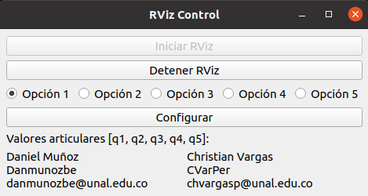
</p>

En principio, se planteó una configuración diferente de las enunciadas para el mecanismo, modificación que era admisible según la guía de laboratorio. Los valores articulares correspondientes se muestran en la sección de [Comparaciones](#comparación-de-configuraciones). Ahora bien, para lograr dichas configuraciones, se utilizó la función `submit_options`, en donde, tras seleccionar alguno de los botones radiales y oprimir el botón "Configurar", las articulaciones se mueven secuencialmente desde la base para llegar a la posición deseada, empleando las funciones de la sección anterior.

### Simulación en video y comprobación de los ángulos

A continuación, se puede acceder a la demostración del funcionamiento de la manipulación del robot mediante Rospy y RVIZ. Para acceder al video, se puede dar click en la imagen:
<p align="center">
    <a href="https://youtu.be/Ho8k9srPNIc">
    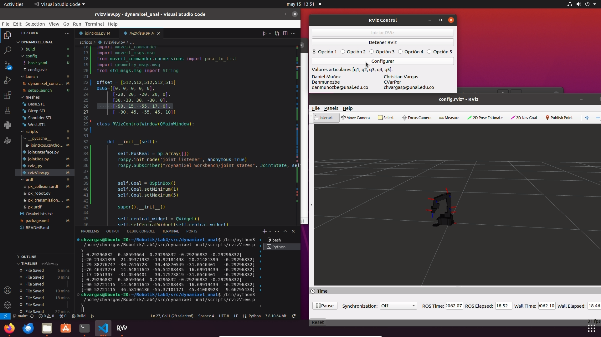
    </a>
</p>

En la visualización en RVIZ se evidencia que hay una simulación que utiliza modelos .stl para cada eslabón del robot. Estos, juntos con los elementos necesarios como el archivo .launch, usaron el repositorio de [Felipe González](https://github.com/fegonzalez7) que se puede encontrar en la sección de [Bibliografía](#bibliografía). Este método ofrece fuertes ventajas frente a la representación con el Toolbox, pues permite monitorear y representar el movimiento del robot en tiempo real, por eso se optó por utilizar estos recursos disponibles. 


## Comparación de Configuraciones

Por otra parte, la implementación del toolbox de Peter Corke se realizó con Matlab, en donde se representó gráficamente cada una de las posiciones planteadas en la matriz de configuraciones

### Configuración 1 (Home): 0, 0, 0, 0
<div style="display: flex;">
  <div style="flex: 1; text-align: center;">
    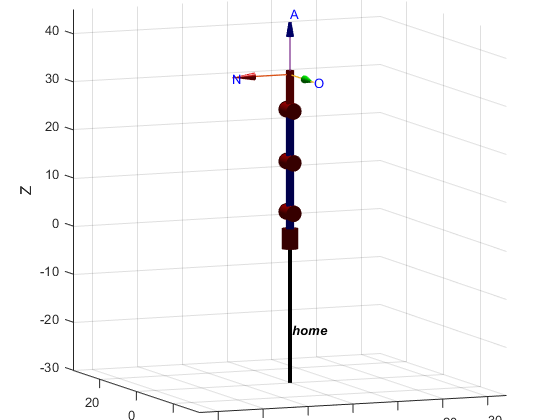
  </div>
  <div style="flex: 1; text-align: center;">
    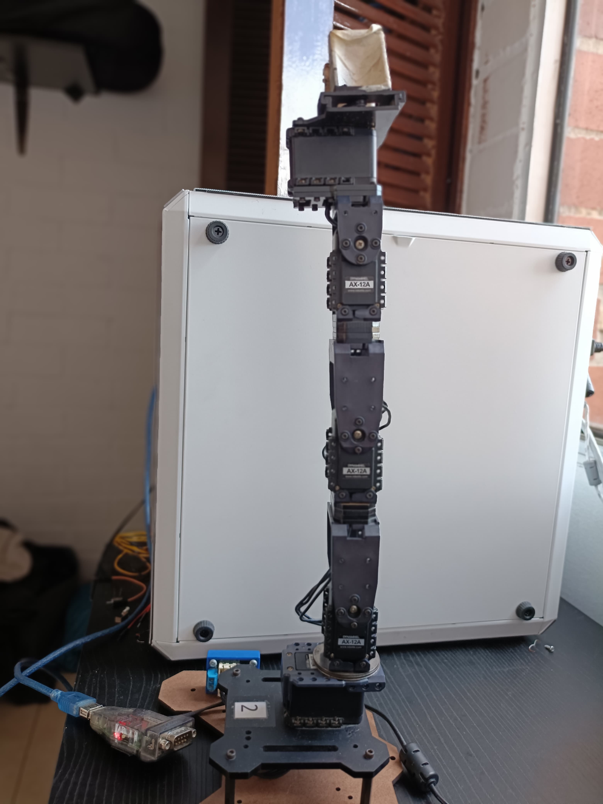
  </div>
</div>

### Configuración 2: -20, 20, -20, 20
<div style="display: flex;">
  <div style="flex: 1; text-align: center;">
    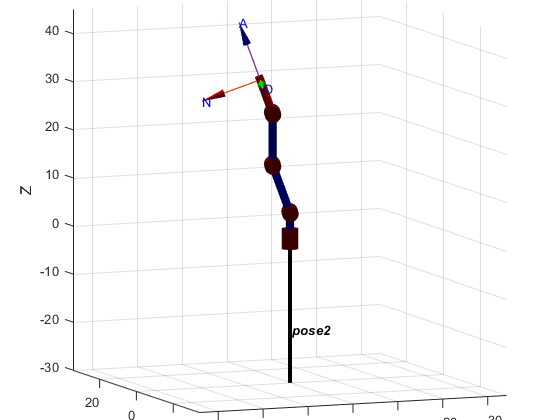
  </div>
  <div style="flex: 1; text-align: center;">
    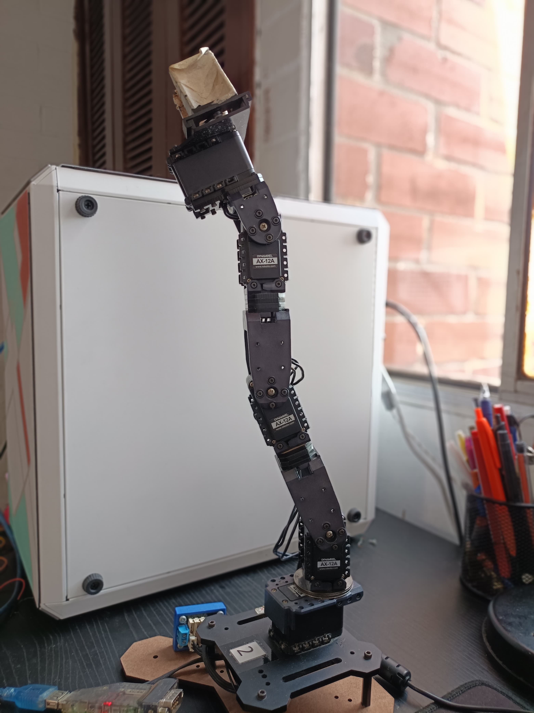
  </div>
</div>

### Configuración 3: 30, -30, 30, -30
<div style="display: flex;">
  <div style="flex: 1; text-align: center;">
    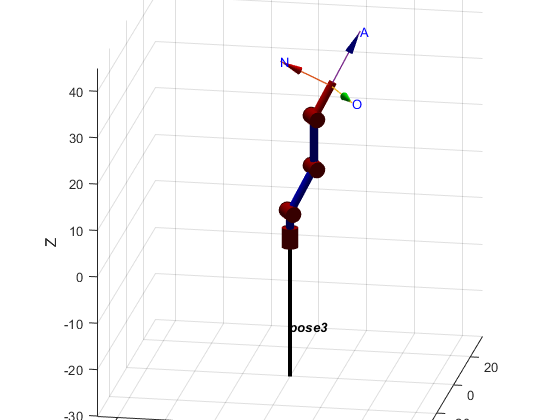
  </div>
  <div style="flex: 1; text-align: center;">
    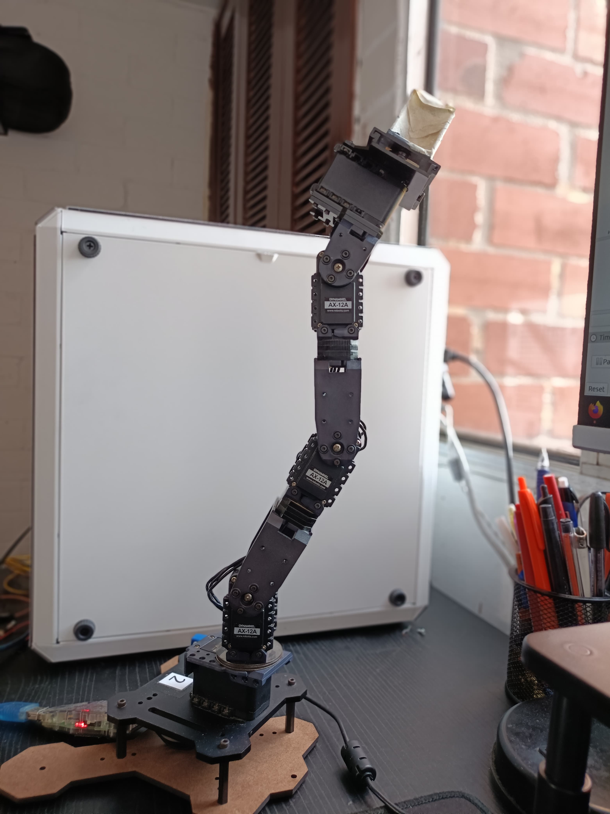
  </div>
</div>

### Configuración 4: -90, 15, -55, 17
<div style="display: flex;">
  <div style="flex: 1; text-align: center;">
    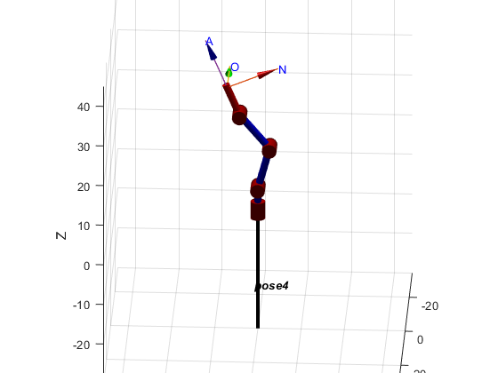
  </div>
  <div style="flex: 1; text-align: center;">
    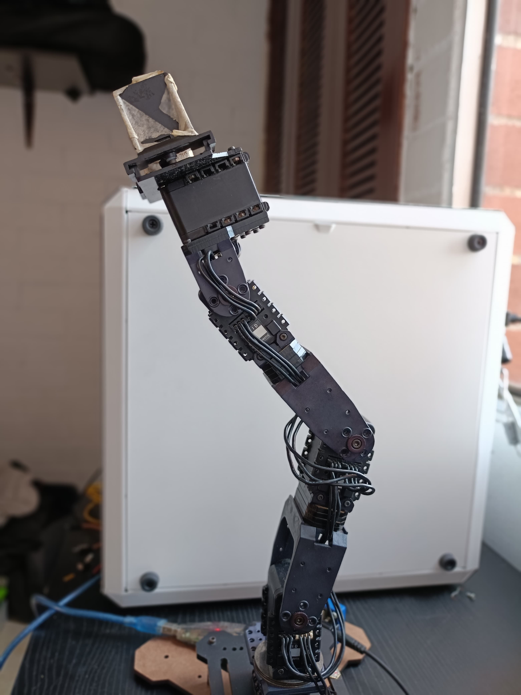
  </div>
</div>

### Configuración 5: -90, 45, -55, 45
<div style="display: flex;">
  <div style="flex: 1; text-align: center;">
    
  </div>
  <div style="flex: 1; text-align: center;">
    
  </div>
</div>

A partir de las imágenes anteriores, y del video en la sección de [Simulación](#simulación-en-video-y-comprobación-de-los-ángulos), se evidencia que el robot siguió el comportamiento esperado, con un desfase mínimo que corresponde, en la mayoría de casos, a una unidad de registro con el que cuentan los motores (0.29° aproximadamente). Si bien no fue necesario usar los offsets definidos, esta variación puede deberse, entre otros factores como el posible desgaste de los motores para el punto en que se realizó el laboratorio, al peso y consecuente inercia que ejerce sobre el mecanismo el motor 5 presente en la articulación de la pinza.


## Bibliografía

- Documentación del servomotor Dynamixel AX-12A. Recuperado de [https://emanual.robotis.com/docs/en/dxl/ax/ax-12a/](https://emanual.robotis.com/docs/en/dxl/ax/ax-12a/)
- Repositorio de GitHub del proyecto "px_robot" de fegonzalez7. Disponible en [https://github.com/fegonzalez7/px_robot](https://github.com/fegonzalez7/px_robot)
- Diapositivas de clase de Robótica sobre cinemática directa, por Pedro Cárdenas
